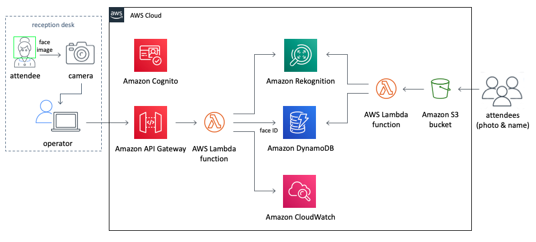

## This is a guideline for check In App [here](https://aws.amazon.com/solutions/implementations/auto-check-in-app/?nc1=h_ls#) Please refer to the implementation guide at the page for more detail information.

Check In App is an application to compare faces for check-in events. During event registration, users need to take a user picture's face, and the picture will be validated once the users would like to log in or enter to the event.

Here's the reference architecture for the event check in.

---
## Prerequisites
1. AWS CLI version 1.16.243 or recent
2. Python version 3.7 or recent
3. OpenCV version 4.1.0 or recent
4. Boto3 python installed
5. git installed to access repository locally
6. Prepare 1 selfie on .jpg format

---
## Prerequisites version that has been used for current demo
1. AWS CLI version 2.0.4
2. Python version 3.7.4
3. Open CV version 4.5.2
4. Boto3 version 1.17.73
5. git version 2.23.0
6. Tested on MacOS environment
7. using `us-east-1` Region

---

## Agenda
0. [Install prerequisites (you can skip if you have installed all of the prerequisites)](docs/Eng/Prerequisites.md)
1. [Run CloudFormation Stack template for infrastructure](docs/Eng/CloudFormationStack.md)
2. [Upload Registration Image to Amazon S3](docs/Eng/UploadImageS3.md)
3. [Download and configure the app](docs/Eng/ConfigureApp.md)
4. [Launch and run the App](docs/Eng/LaunchApp.md)