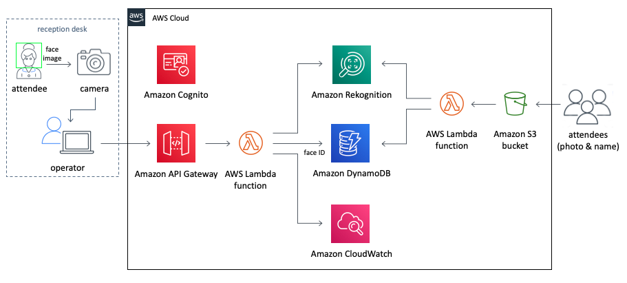

## Ini merupakan petunjuk dari check In App [disini](https://aws.amazon.com/solutions/implementations/auto-check-in-app/?nc1=h_ls#) mohon merujuk ke petunjuk implementasi dalam halaman ini untuk detail selanjutnya.

Check In App adalah aplikasi untuk membandingkan wajah pada saat event check-in. Sewaktu registrasi event, pengguna diharapkan untuk mengambil gambar muka pengguna, dan gambar akan divalidasi pada saat pengguna ingin login atau masuk ke dalam event.

Berikut adalah referensi mengenai arsitektur untuk event check in.

---
## Prasyarat
1. AWS CLI versi 1.16.243 atau lebih baru
2. Python versi 3.7 atau lebih baru
3. OpenCV versi 4.1.0 atau lebih baru
4. Boto3 python sudah terinstallasi
5. git sudah terinstallasi untuk mengakses repository secara lokal
6. Siapkan 1 selfie dalam format .jpg

---
## Prasyarat versi yang telah digunakan untuk demo ini
1. AWS CLI versi 2.0.4
2. Python versi 3.7.4
3. Open CV versi 4.5.2
4. Boto3 versi 1.17.73
5. git versi 2.23.0
6. Telah dites dalam MacOS
7. menggunakan region `us-east-1`

---

## Agenda
0. [Menginstalasi prasyarat (anda dapat lewatkan tahap ini jika anda sudah pernah menginstalasi semua prasyarat)](docs/Ind/Prerequisites.md)
1. [Menjalankan template CloudFormation Stack untuk infrastruktur](docs/Ind/CloudFormationStack.md)
2. [Mengunggah Gambar registrasi ke Amazon S3](docs/Ind/UploadImageS3.md)
3. [Mengunduh dan melakukan konfigurasi dalam aplikasi](docs/Ind/ConfigureApp.md)
4. [Meluncurkan dan menjalaknakn aplikasi](docs/Ind/LaunchApp.md)