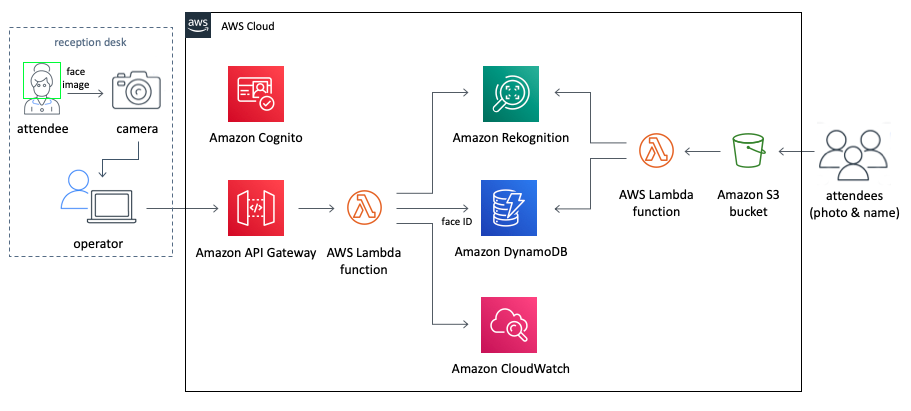

# Check In App Guidance

## This is a guideline for check In App [here](https://aws.amazon.com/solutions/implementations/auto-check-in-app/?nc1=h_ls#) Please refer to the implementation guide at the page for more detail information.

Check In App is an implementation to compare faces for check-in events. During event registration, users need to take a picture, and the picture will be validated once the users would like to log in or enter to the event.

Here's the reference architecture for the event check in.

---
## Prerequisites
1. AWS CLI version 1.16.243 or recent
2. Python version 3.7 or recent
3. OpenCV 4.1.0 or recent
4. Boto3 python installed
5. git installed to access repository locally

---

## Agenda
0. Install prerequisites
1. Run CloudFormation Stack template for infrastructure
2. Upload Registration Image to Amazon S3
3. Download and configure the app
4. Launch and run the App

---
## 0. Install prerequisites

---
## 1. Run CloudFormation Stack template for infrastructure

---
## 2. Upload Registration Image to Amazon S3

---
## 3. Download and configure the app

---
## 4. Launch and run the App