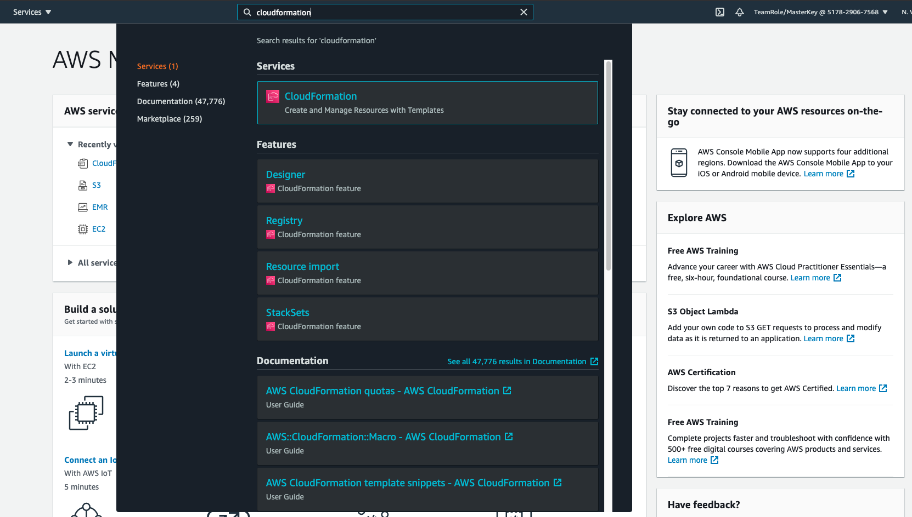
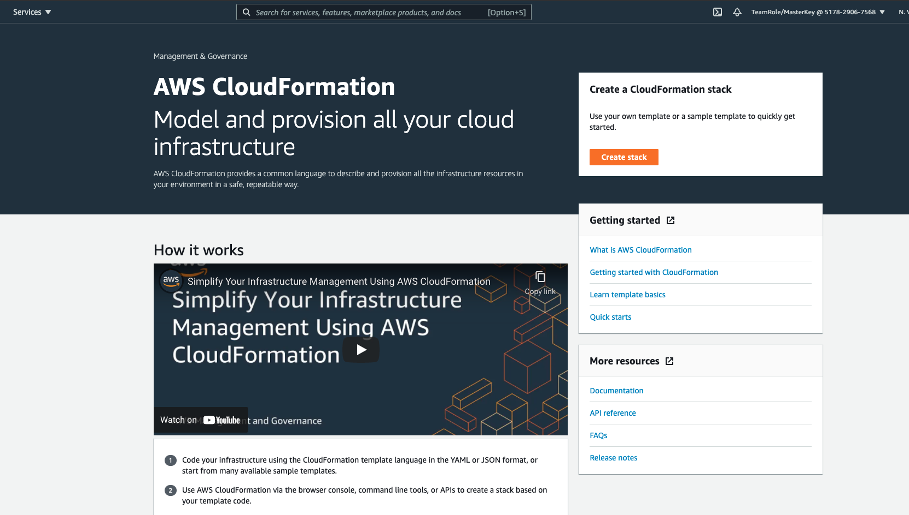
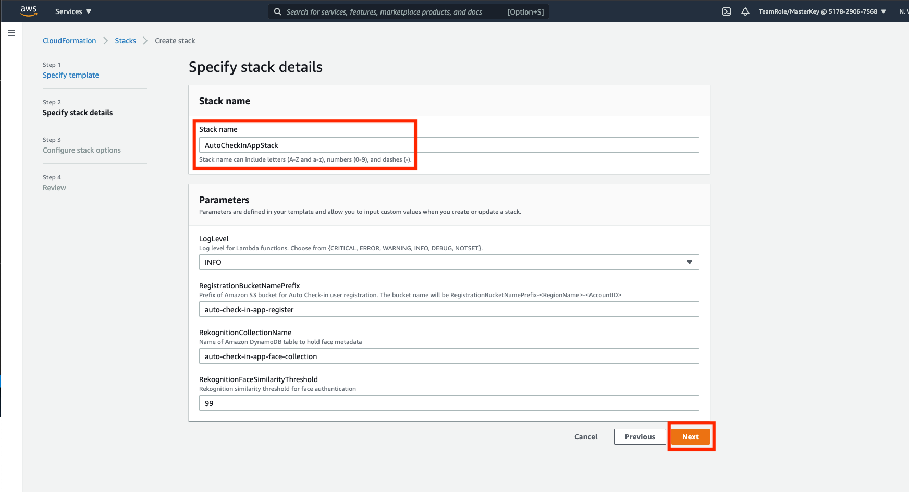
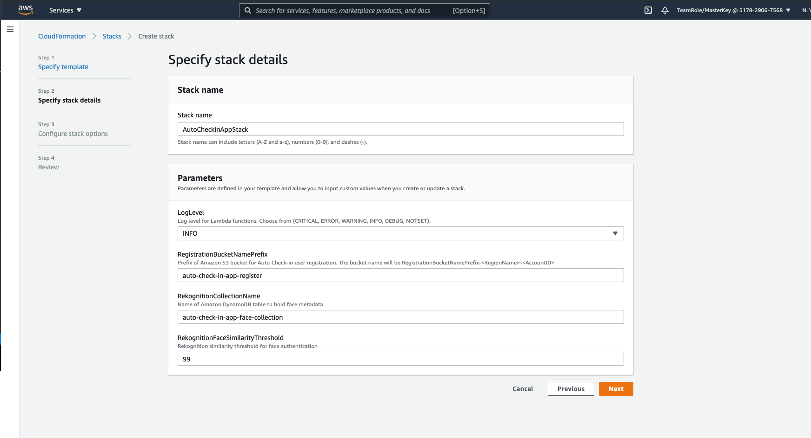
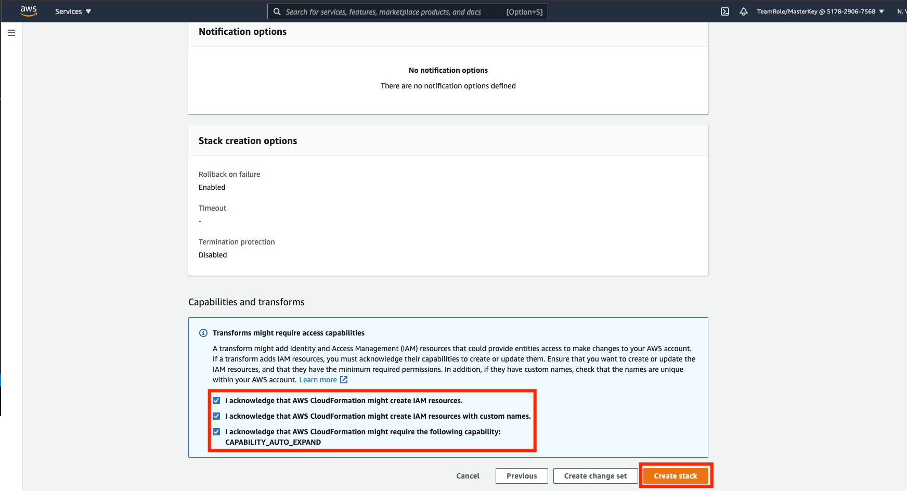
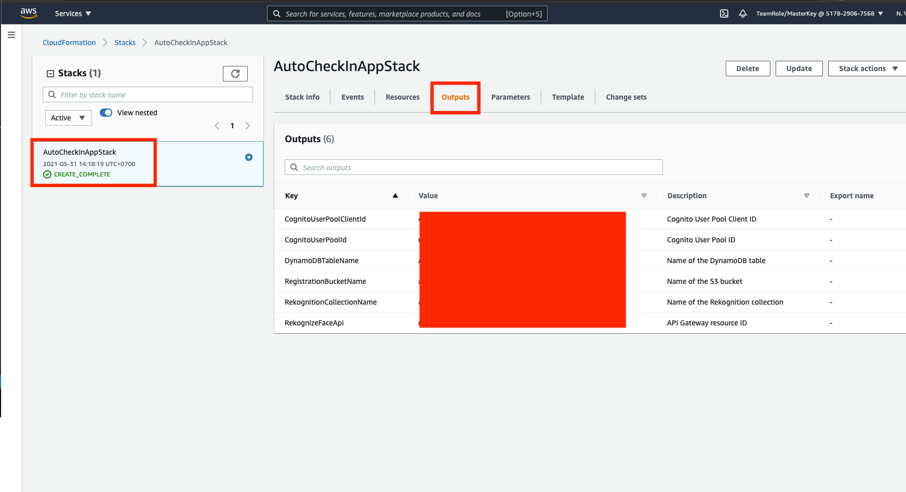

## Run CloudFormation Stack template for infrastructure

1. Please download [this template file](file/auto-check-in-app.template) on your local computer by right click the hyperlink and choose `Save Link As`
2. go to [AWS Console](https://console.aws.amazon.com/console/home?region=us-east-1#)
3. open CloudFormation by filling the service name above and type `CloudFormation` and click the section.
    
4. Click `Create stack`
    
5. In prepare template, choose `Template is ready` and click `Upload a template file`
6. Upload the `auto-check-in-app.template` file at the 1st step.
7. click `Next`
    
8. in stack name, fill it with `AutoCheckInAppStack` and click `Next`
    
9. in Configure stack options page, click `Next`
10. in review page, make sure to check every checkbox in capabilities and transforms section
11. click `Create stack`
    

This will take a while to set up the stack.

12. Once it's complete, it will display `CREATE_COMPLETE` on the left side of stack
    

13. Please click the `Outputs` tab and make sure to not close the page, since you will need it later.

[BACK TO WORKSHOP GUIDE](../README.md)