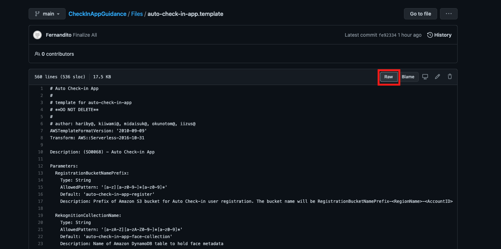
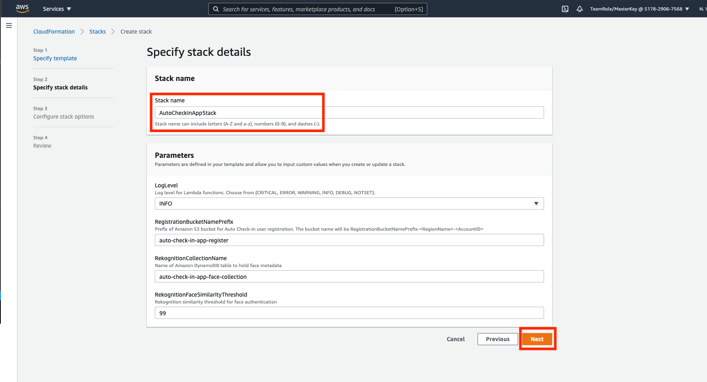

## Run CloudFormation Stack template for infrastructure

1. go to [AWS Console](https://console.aws.amazon.com/console/home?region=us-east-1#)
2. open CloudFormation by filling the service name above and type `CloudFormation` and click the section.

    

3. Click `Create stack`

    

4. In prepare template, choose `Template is ready` and click `Upload a template file`
5. Download [this file](../../Files/auto-check-in-app.template) by right clicking the link and open it in a new tab. click raw button and right click the area. save it as `auto-check-in-app.template`. Please don't use `.txt` file. Then, choose the file that you have downloaded in CloudFormation AWS Console page.

    

    

6. click `Next`

    

7. in stack name, fill it with `AutoCheckInAppStack` and click `Next`

    

8. in Configure stack options page, click `Next`
9. in review page, make sure to check every checkbox in capabilities and transforms section
10. click `Create stack`

    

This will take a while to set up the stack.

11. Once it's complete, it will display `CREATE_COMPLETE` on the left side of stack
12. Please click the `Outputs` tab and make sure to not close the page, since you will need it later.

    

[BACK TO WORKSHOP GUIDE :house:](../../EnglishGuide.md)

[CONTINUE TO NEXT GUIDE :arrow_right:](UploadImageS3.md)

[BACK TO PREVIOUS GUIDE :arrow_left:](Prerequisites.md)