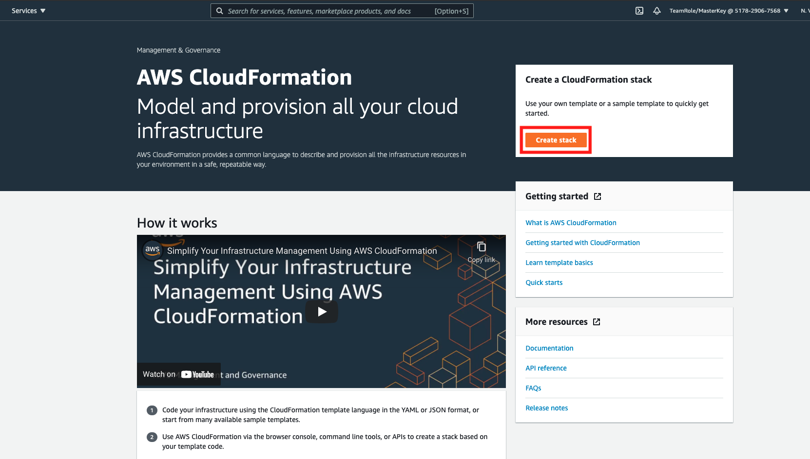
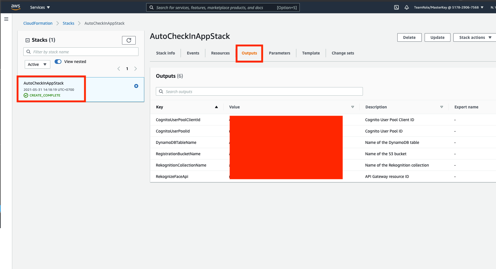

## Run CloudFormation Stack template for infrastructure

1. go to [AWS Console](https://console.aws.amazon.com/console/home?region=us-east-1#)
2. open CloudFormation by filling the service name above and type `CloudFormation` and click the section.

    

3. Click `Create stack`

    

4. In prepare template, choose `Template is ready` and click `Amazon S3 URL`
5. Copy and paste this S3 URL `https://s3.amazonaws.com/solutions-reference/auto-check-in-app/latest/auto-check-in-app.template`
6. click `Next`

    

7. in stack name, fill it with `AutoCheckInAppStack` and click `Next`

    

8. in Configure stack options page, click `Next`
9. in review page, make sure to check every checkbox in capabilities and transforms section
10. click `Create stack`

    

This will take a while to set up the stack.

11. Once it's complete, it will display `CREATE_COMPLETE` on the left side of stack
12. Please click the `Outputs` tab and make sure to not close the page, since you will need it later.

    

[BACK TO WORKSHOP GUIDE](../../EnglishGuide.md)

[CONTINUE TO NEXT GUIDE](UploadImageS3.md)

[BACK TO PREVIOUS GUIDE](Prerequisites.md)