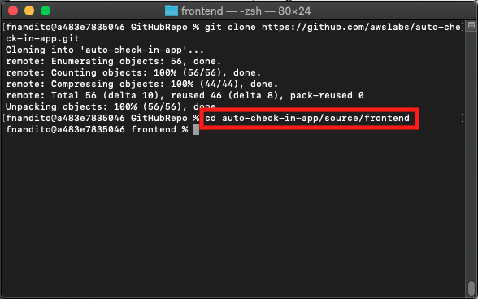
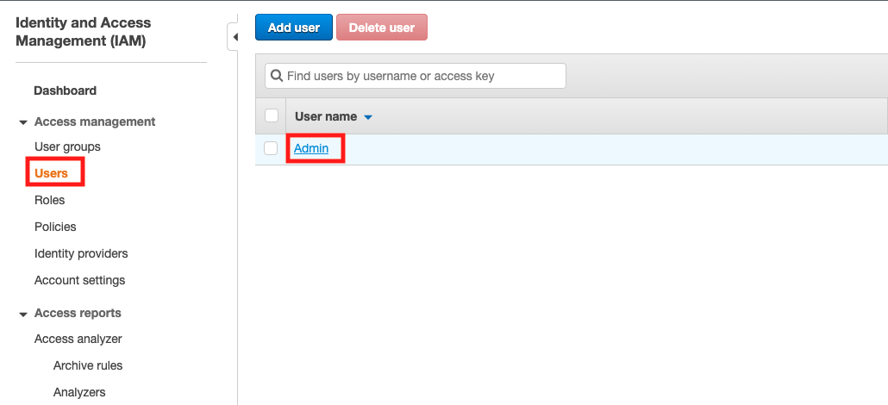
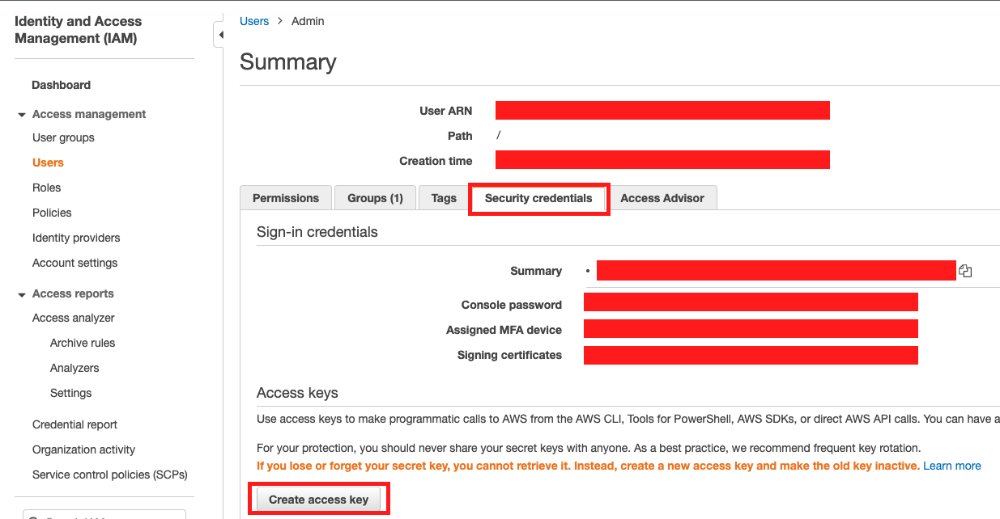
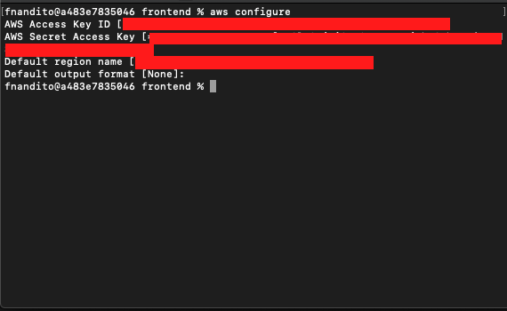
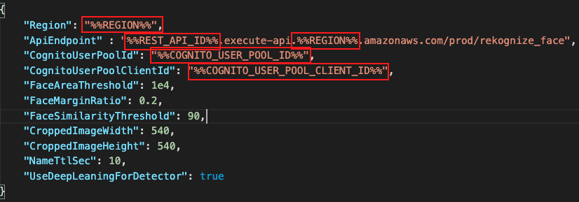

## Download and configure the app

1. On your computer, run the following command in your preferred directory to clone the application source code from GitHub

```
git clone https://github.com/awslabs/auto-check-in-app.git
```

2. open the folder using your favourite text editor. In this demo, I use Visual Studio Code
3. After the code is cloned, navigate to the `auto-check-in-app/source/frontend` directory on your terminal. You might use this command `cd auto-check-in-app/source/frontend`

    

4. Run the following command `chmod +x register-operator.sh`
5. open `register-operator.sh` file
6. edit the `REGION` to `us-east-1`
7. edit the `stack name` to `AutoCheckInAppStack` and save the file

    

Now, we need to create the access key and secret access key to access for AWS CLI

8. go to [IAM console](https://console.aws.amazon.com/iam/home?region=us-east-1)
9. click `Users` and click your username.

    

10. click `Security Credentials`
11. in access keys, click `Create access key`

    

12. click `Download .csv file` and open that file.
13. in your terminal, type `aws configure`
14. fill the Access key ID match with the .csv file and click enter
14. fill the Secret Access Key match with the .csv file and click enter
15. fill the default region name as `us-east-1` and click enter
16. click enter for default output format.

    

Now, we can run the script to create the account.

17. Run the following command on your terminal `./register-operator.sh <your E-mail address>`
18. Enter your password. Please remember it.

    

19. Open the `default.env.json` file and copy the file to `env.json`.
20. Go to [CloudFormation Console](https://console.aws.amazon.com/cloudformation/home?region=us-east-1#/stacks?filteringStatus=active&filteringText=&viewNested=true&hideStacks=false)
21. click `AutoCheckInAppStack` name
22. click `Outputs` tab.
23. Modify `env.json` file with the applicable values (Region, ApiEndpoint, CognitoUserPoolId, CognitoUserPoolClientID)

    | Field                             | Replace With                          |
    | --------------------------------- | ------------------------------------- |
    | %%REGION%%                        | us-east-1                             |
    | %%REST_API_ID%%                   | copy `RekognizeFaceApi` value         |
    | %%COGNITO_USER_POOL_ID%%          | copy `CognitoUserPoolId` value        |
    | %%COGNITO_USER_POOL_CLIENT_ID%%   | copy `CognitoUserPoolClientId` value  |

    

24. Open `main.py` file
25. Replace this code

```
print('OpenCV version: {}'.format(cv2.__version__))
(major, minor, _) = cv2.__version__.split('.')
assert major == '4' and minor == '1', 'OpenCV version must be 4.1'
```

to this code

```
print('OpenCV version: {}'.format(cv2.__version__))
(major, minor, _) = cv2.__version__.split('.')
assert major >= '4' and minor >= '1', 'OpenCV version must be at least 4.1'
```

[BACK TO WORKSHOP GUIDE :house:](../../EnglishGuide.md)

[CONTINUE TO NEXT GUIDE :arrow_right:](LaunchApp.md)

[BACK TO PREVIOUS GUIDE :arrow_left:](UploadImageS3.md)