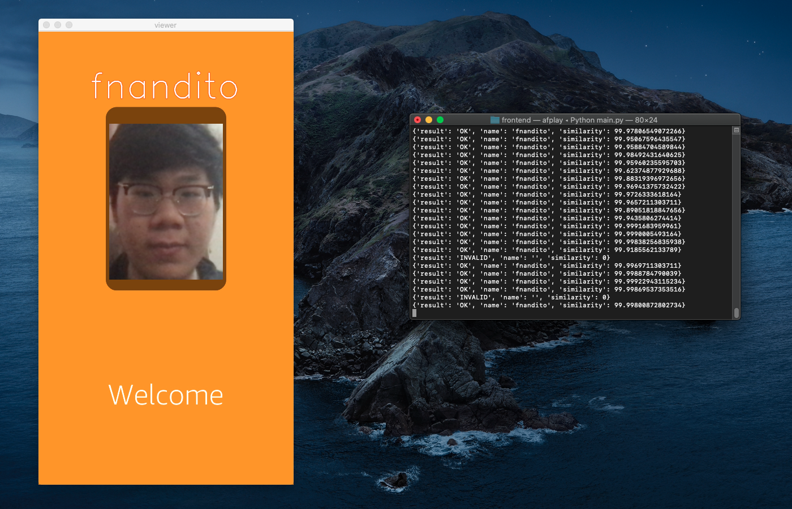

## Launch and run the App

1. in your local terminal, run command `python3 main.py`

Note: Don't run this command on your visual studio code terminal, since you need to open the access of camera by opening it on your settings.

2. fill your username as your email during registration.
3. fill your password.

now, your camera will turn on and please hover your face towards the camera for around 30 cm, or 12 feet from the camera.

4. If the application recognizes you, it will turn on the app and looks like this:

    

5. to turn it off, click control + c on your terminal.

[BACK TO WORKSHOP GUIDE](../../EnglishGuide.md)

[BACK TO PREVIOUS GUIDE](ConfigureApp.md)