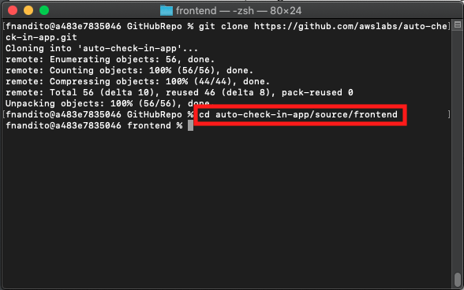
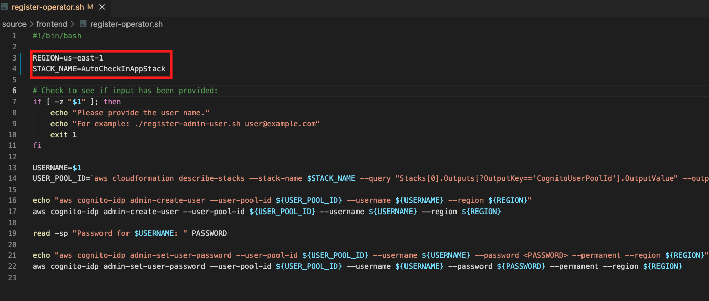
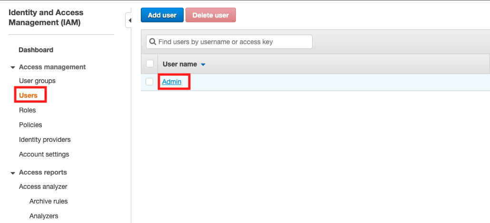
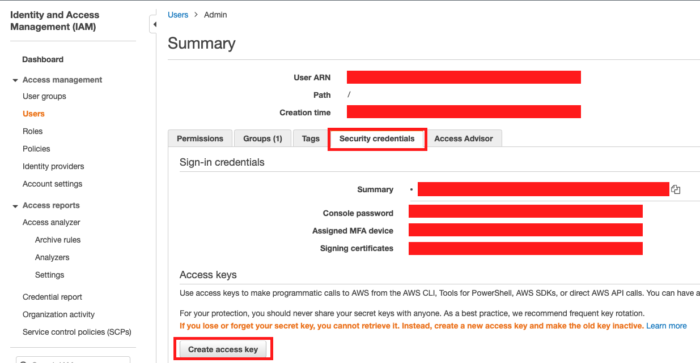
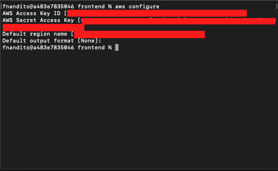
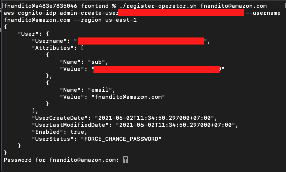
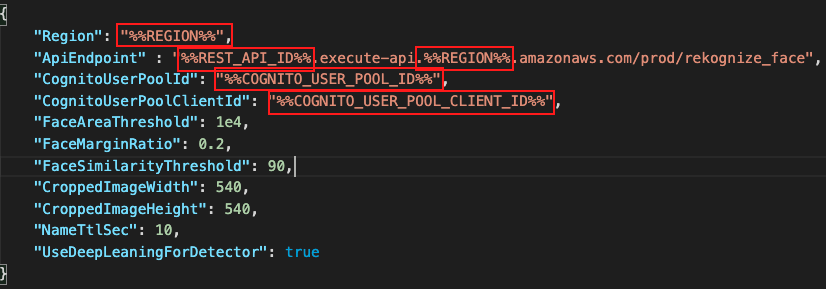

## Mengunduh dan melakukan konfigurasi dalam aplikasi

1. Dalam komputer anda, jalankan command dibawah ini dalam direktori yang diinginkan untuk melakukan *clone* sumber kode aplikasi dari GitHub

```
git clone https://github.com/awslabs/auto-check-in-app.git
```

2. buka folder yang telah anda *clone* menggunakan *text editor* favorit anda. Dalam demo ini, Saya menggunakan *Visual Studio Code*
3. Setelah kode telah di *clone*, navigasikan terminal anda ke `auto-check-in-app/source/frontend`. Anda dapat menggunakan *command* ini `cd auto-check-in-app/source/frontend`

    

4. Jalankan *command* ini `chmod +x register-operator.sh`
5. buka file `register-operator.sh`
6. Ubah bagian `REGION` menjadi `us-east-1`
7. Ubah bagian `stack name` menjadi `AutoCheckInAppStack` dan simpan file anda

    

Sekarang, kita akan membuat *access key* dan *secret access key* untuk akses ke AWS CLI

8. pergi ke [IAM console](https://console.aws.amazon.com/iam/home?region=us-east-1)
9. klik `Users` dan klik *username* anda.

    

10. klik `Security Credentials`
11. dalam bagian *access keys*, klik `Create access key`

    

12. klik `Download .csv file` dan buka file itu.
13. dalam terminal anda, ketik `aws configure`
14. isi *Access key ID* sesuai dengan .csv file yang anda telah unduh dan klik enter
14. isi *Secret Access Key* sesuai dengan .csv file dan klik enter
15. isi nama *default region* sebagai `us-east-1` dan klik enter
16. klik enter untuk *default output format*

    

Sekarang, kita dapat jalankan script untuk membuat akun.

17. Jalankan *command* ini dalam terminal anda `./register-operator.sh <your E-mail address>`
18. Masukkan password anda. Mohon untuk diingat.

    

19. Buka file `default.env.json` dan kopi file ke `env.json`.
20. Pergi ke [CloudFormation Console](https://console.aws.amazon.com/cloudformation/home?region=us-east-1#/stacks?filteringStatus=active&filteringText=&viewNested=true&hideStacks=false)
21. klik nama `AutoCheckInAppStack`
22. klik tab `Outputs`
23. Ubah file `env.json` dengan nilai yang sesuai (Region, ApiEndpoint, CognitoUserPoolId, CognitoUserPoolClientID)

    | Nilai                             | Ubah Dengan                           |
    | --------------------------------- | ------------------------------------- |
    | %%REGION%%                        | us-east-1                             |
    | %%REST_API_ID%%                   | kopi nilai `RekognizeFaceApi`         |
    | %%COGNITO_USER_POOL_ID%%          | kopi nilai `CognitoUserPoolId`        |
    | %%COGNITO_USER_POOL_CLIENT_ID%%   | kopi nilai `CognitoUserPoolClientId`  |

    

24. Buka file `main.py`
25. Ganti kode ini

```
print('OpenCV version: {}'.format(cv2.__version__))
(major, minor, _) = cv2.__version__.split('.')
assert major == '4' and minor == '1', 'OpenCV version must be 4.1'
```

menjadi kode ini

```
print('OpenCV version: {}'.format(cv2.__version__))
(major, minor, _) = cv2.__version__.split('.')
assert major >= '4' and minor >= '1', 'OpenCV version must be at least 4.1'
```

[KEMBALI KE PETUNJUK WORKSHOP](../../IndonesiaGuide.md)

[LANJUT KE PETUNJUK SELANJUTNYA](LaunchApp.md)

[KEMBALI KE PETUNJUK SEBELUMNYA](UploadImageS3.md)