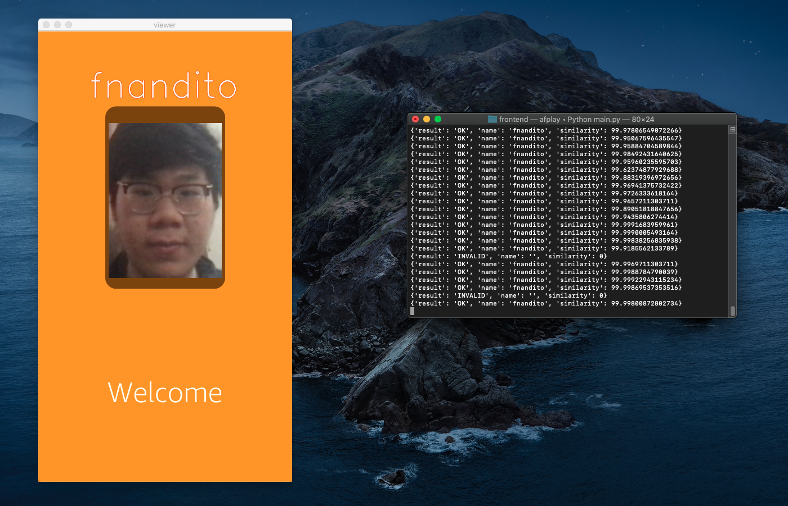

## Meluncurkan dan menjalaknakn aplikasi

1. dalam lokal terminal anda, jalankan *command* `python3 main.py`

Catatan: Jangan jalankan *command* ini dalam terimal visual studio code, karena anda harus memberikan akses kamera kepada visual studio dengan membuka *settings*.

2. isi username anda sesuai dengan email yang anda telah isi pada saat registrasi.
3. isi password anda.

sekarang, kamera anda akan menyala dan mohon untuk meletakkan wajah anda didepan kamera pada jarak sekitar 30 cm, atau 12 feet.

4. Jika aplikasi mengenali wajah anda, maka aplikasi akan menyala dan memberikan tampilan seperti ini:

    

5. untuk mematikannya, klik control + c dalam terminal anda.

[KEMBALI KE PETUNJUK WORKSHOP](../../IndonesiaGuide.md)

[KEMBALI KE PETUNJUK SEBELUMNYA](ConfigureApp.md)