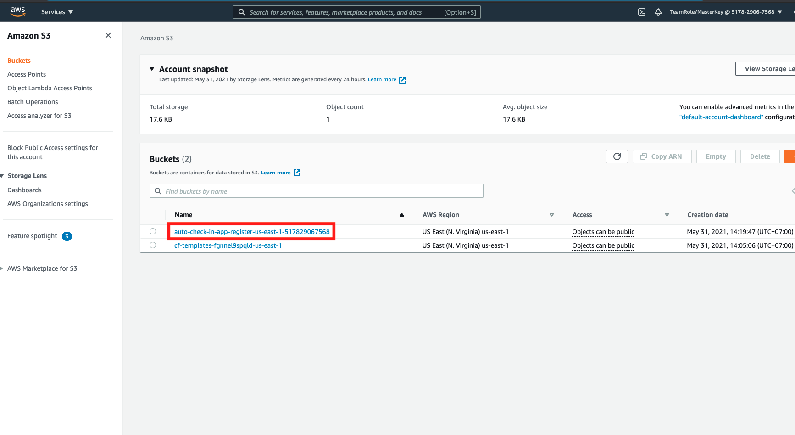
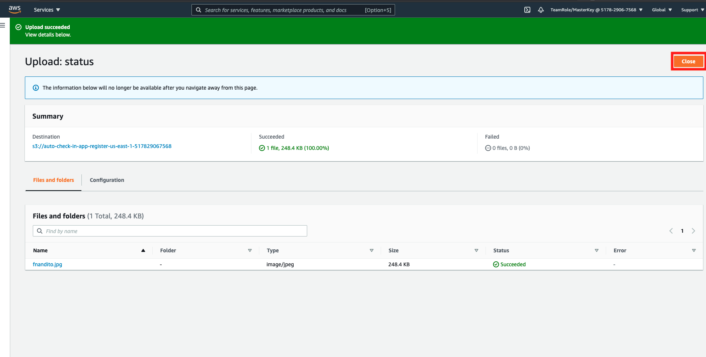

## Mengunggah Gambar registrasi ke Amazon S3

1. Buka [AWS S3 Console](https://s3.console.aws.amazon.com/s3/home?region=us-east-1#)
2. klik nama *bucket* `auto-check-in-app-register...`
    
3. dalam halaman *bucket*, klik `Upload`
4. dalam halaman *upload*, anda dapat menarik dan meletakkan gambar langsung ke halaman ini, atau anda bisa juga untuk mengeklik tombol `Add files` untuk mengunggah gambar. Pastikan format gambar anda adalah format `.jpg`
5. Setelah gambar telah diunggah, klik `Upload`
    
6. setelah diunggah, klik `close`
    
7. Jika proses pengunggahan berhasil, anda tidak dapat melihat gambar anda dalam *bucket*.
    

[KEMBALI KE PETUNJUK WORKSHOP](../../IndonesiaGuide.md)

[LANJUT KE PETUNJUK SELANJUTNYA](ConfigureApp.md)

[KEMBALI KE PETUNJUK SEBELUMNYA](CloudFormationStack.md)